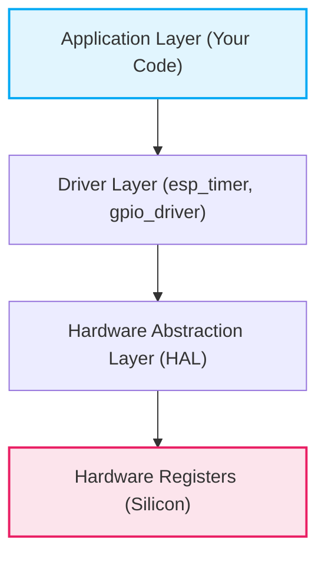

# GPIO (General Purpose Input/Output) Driver

## Table of Contents
- [1. What is GPIO?](#1-what-is-gpio)
- [2. A Layered Explanation](#2-a-layered-explanation)
- [3. ESP32 GPIO Features](#3-esp32-gpio-features)
- [4. ESP-IDF GPIO API Workflow](#4-esp-idf-gpio-api-workflow)
- [5. Interrupt Handling (ISR)](#5-interrupt-handling-isr)
- [6. Top 10 Essential GPIO APIs](#6-top-10-essential-gpio-apis)

---

## 1. What is GPIO?
**GPIO (General Purpose Input/Output)** pins are the physical interface between the microcontroller and the outside world. They can be programmed dynamically to read digital signals (inputs) from sensors or switches, or to output digital signals (outputs) to control LEDs, relays, or actuators.

## 2. A Layered Explanation
In modern Embedded Linux or RTOS environments like ESP-IDF, GPIO interaction is not done by directly manipulating memory-mapped registers (though possible). It is abstracted into layers:



*   **Application Layer:** Your high-level business logic.
*   **Driver Layer:** Provides standard API functions (e.g., `gpio_set_level`).
*   **HAL:** Translates driver commands into specific register bit manipulations.
*   **Hardware:** The actual physical silicon circuitry.

## 3. ESP32 GPIO Features
The ESP32 family offers highly flexible GPIO routing and capabilities:
*   **Internal Pull-Up/Pull-Down:** Resistors can be enabled internally, saving external components and reducing PCB complexity.
*   **Interrupts:** Any GPIO can trigger an interrupt on a rising edge, falling edge, or both.
*   **RTC GPIOs:** Certain pins are connected to the Ultra-Low-Power (ULP) co-processor and can wake the chip from deep sleep.
*   **Matrix Routing:** Many internal peripherals (UART, SPI, I2C) can be routed to almost any GPIO pin using the internal GPIO Matrix.

## 4. ESP-IDF GPIO API Workflow

To use a GPIO in ESP-IDF, you typically configure a `gpio_config_t` struct and pass it to `gpio_config()`.

| Step                  | Action                                                          | API Function                      |
| :-------------------- | :-------------------------------------------------------------- | :-------------------------------- |
| **1. Configuration**  | Set pin, mode (input/output), pull-up/down, and interrupt type. | `gpio_config(&config_struct)`     |
| **2. Write (Output)** | Set the pin high (1) or low (0).                                | `gpio_set_level(GPIO_NUM, level)` |
| **3. Read (Input)**   | Read the current digital level of the pin.                      | `gpio_get_level(GPIO_NUM)`        |

## 5. Interrupt Handling (ISR)
When configuring a pin as an interrupt, you must allocate an ISR service and register a handler.

> [!WARNING]  
> **Keep ISRs Short!** Interrupt Service Routines (ISRs) block other tasks. They should only do minimal work (like setting a flag or giving a FreeRTOS semaphore) and defer the heavy processing to a standard task.
> In ESP-IDF, ISR handlers should have the `IRAM_ATTR` macro so they are placed in Internal RAM for speed and to avoid flash cache misses during execution.

## 6. Top Essential GPIO APIs

Here are the 10 most critical functions used to configure and manage GPIOs in ESP-IDF.

### 1. `gpio_config`
Configures a GPIO's mode, pull-up/down, and interrupts all at once using a configuration struct.
```c
esp_err_t gpio_config(const gpio_config_t *pGPIOConfig);
```

### 2. `gpio_reset_pin`
Resets a pin to its default state. Highly recommended before configuring a pin.
```c
esp_err_t gpio_reset_pin(gpio_num_t gpio_num);
```

### 3. `gpio_set_direction`
Sets a GPIO pin to act as an input, output, or both.
```c
esp_err_t gpio_set_direction(gpio_num_t gpio_num, gpio_mode_t mode);
```

### 4. `gpio_set_level`
Sets the digital output level of a pin (1 for HIGH, 0 for LOW).
```c
esp_err_t gpio_set_level(gpio_num_t gpio_num, uint32_t level);
```

### 5. `gpio_get_level`
Reads the current digital level of an input pin.
```c
int gpio_get_level(gpio_num_t gpio_num);
```

### 6. `gpio_set_pull_mode`
Enables or disables internal pull-up and pull-down resistors for input pins.
```c
esp_err_t gpio_set_pull_mode(gpio_num_t gpio_num, gpio_pull_mode_t pull);
```

### 7. `gpio_install_isr_service`
Allocates the global ISR service for GPIO interrupts. Must be called before adding specific handlers.
```c
esp_err_t gpio_install_isr_service(int intr_alloc_flags);
```

### 8. `gpio_isr_handler_add`
Registers a specific handler function to execute when a pin's interrupt fires.
```c
esp_err_t gpio_isr_handler_add(gpio_num_t gpio_num, gpio_isr_t isr_handler, void *args);
```

### 9. `gpio_intr_enable`
Enables the interrupt module for a specific GPIO pin.
```c
esp_err_t gpio_intr_enable(gpio_num_t gpio_num);
```

### 10. `gpio_intr_disable`
Disables the interrupt module for a specific GPIO pin.
```c
esp_err_t gpio_intr_disable(gpio_num_t gpio_num);
```

