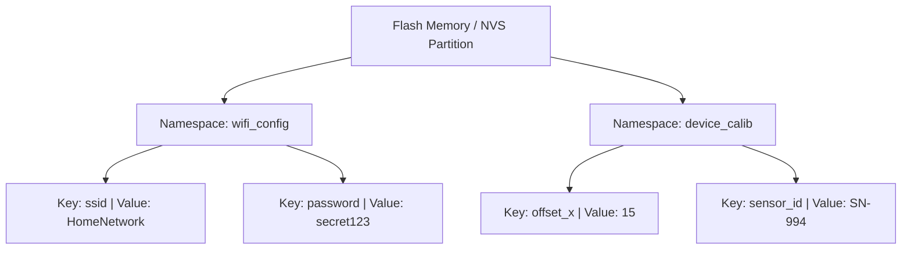
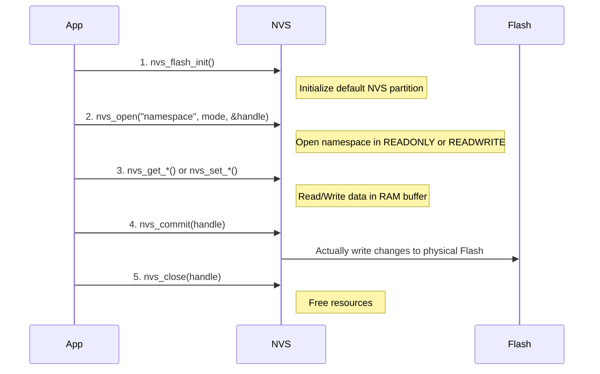

# NVS (Non-Volatile Storage) Driver

## Table of Contents
- [1. Introduction to NVS](#1-introduction-to-nvs)
- [2. Why use NVS in IoT?](#2-why-use-nvs-in-iot)
- [3. NVS Architecture & Core Concepts](#3-nvs-architecture--core-concepts)
- [4. Supported Data Types](#4-supported-data-types)
- [5. ESP-IDF NVS API Workflow](#5-esp-idf-nvs-api-workflow)
- [6. Code Example: Writing and Reading from NVS](#6-code-example-writing-and-reading-from-nvs)

---

## 1. Introduction to NVS
**NVS (Non-Volatile Storage)** is a library in the ESP-IDF framework designed to store key-value pairs in the flash memory. Unlike traditional file systems (like FAT or SPIFFS), NVS is highly optimized for storing small amounts of configuration data that need to persist across power cycles and reboots.

## 2. Why use NVS in IoT?
In IoT devices, you frequently need to store persistent parameters without the overhead of a full file system. 

**Common Use Cases:**
*   **Network Credentials:** Storing Wi-Fi SSIDs and passwords so the device auto-connects on boot.
*   **Device Configuration:** Saving calibration data, unique device IDs, and user preferences.
*   **State Saving:** Remembering the last state of a device (e.g., relay ON/OFF state) before a power failure to restore it upon restart.
*   **Security Keys:** Storing tokens or certificates securely.

## 3. NVS Architecture & Core Concepts

NVS organizes data hierarchically using **Namespaces** and **Keys**.

| Concept | Description | Analogy |
| :--- | :--- | :--- |
| **Namespace** | A logical grouping of keys to prevent name collisions. Max length is 15 characters. | A folder or directory. |
| **Key** | The unique identifier for a specific piece of data within a namespace. Max length is 15 characters. | A file name. |
| **Value** | The actual data stored against the key. | The contents of the file. |



## 4. Supported Data Types
NVS supports various primitive data types and binary blobs. 

*   **Integer Types:** `uint8_t`, `int8_t`, `uint16_t`, `int16_t`, `uint32_t`, `int32_t`, `uint64_t`, `int64_t`
*   **Strings:** Null-terminated strings.
*   **Blobs:** Variable length binary data (e.g., custom `structs` or arrays).

## 5. ESP-IDF NVS API Workflow

Using the NVS driver involves a specific sequence of operations to ensure data integrity:



> [!WARNING]  
> **Always Commit!** Changes made using `nvs_set_*` are only written to the RAM representation of NVS initially. They are pushed to the physical flash memory **only when `nvs_commit()` is called**. Forgetting to commit is a very common source of data loss bugs.

## 6. Essential NVS APIs

Here are the most important functions used to interact with the NVS driver. 

### 1. `nvs_flash_init`
Initializes the default NVS partition. This is the first step before any NVS operation.
```c
esp_err_t nvs_flash_init(void);
```
**Arguments:** None.  
**Returns:** `ESP_OK` on success, or an error code (e.g., `ESP_ERR_NVS_NO_FREE_PAGES`).

### 2. `nvs_open`
Opens an NVS namespace and provides a handle for read/write operations.
```c
esp_err_t nvs_open(const char* name, nvs_open_mode_t open_mode, nvs_handle_t *out_handle);
```
**Arguments:**
*   `name`: The namespace string (max 15 characters).
*   `open_mode`: Operational mode (`NVS_READONLY` or `NVS_READWRITE`).
*   `out_handle`: Pointer to an `nvs_handle_t` variable to store the opened handle.

### 3. `nvs_set_*` (Write Data)
Writes data of a specific type to the provided key. (Data is held in RAM until committed).
```c
esp_err_t nvs_set_i32(nvs_handle_t handle, const char* key, int32_t value);
esp_err_t nvs_set_str(nvs_handle_t handle, const char* key, const char* value);
```
**Arguments:**
*   `handle`: The NVS handle returned by `nvs_open`.
*   `key`: The key string (max 15 characters).
*   `value`: The data to store.

### 4. `nvs_get_*` (Read Data)
Reads data associated with a specific key.
```c
esp_err_t nvs_get_i32(nvs_handle_t handle, const char* key, int32_t* out_value);
esp_err_t nvs_get_str(nvs_handle_t handle, const char* key, char* out_value, size_t* length);
```
**Arguments:**
*   `handle`: The NVS handle.
*   `key`: The key string to retrieve.
*   `out_value`: Pointer to the variable where the read data will be stored.
*   `length` (for string/blob): Pointer to a size variable. It specifies max length on input, and returns actual length on output.

### 5. `nvs_commit`
Commits any pending changes made via `nvs_set_*` to the physical flash memory.
```c
esp_err_t nvs_commit(nvs_handle_t handle);
```
**Arguments:**
*   `handle`: The NVS handle to commit changes for.

### 6. `nvs_close`
Closes the storage handle and frees up resources.
```c
void nvs_close(nvs_handle_t handle);
```
**Arguments:**
*   `handle`: The NVS handle to close.

